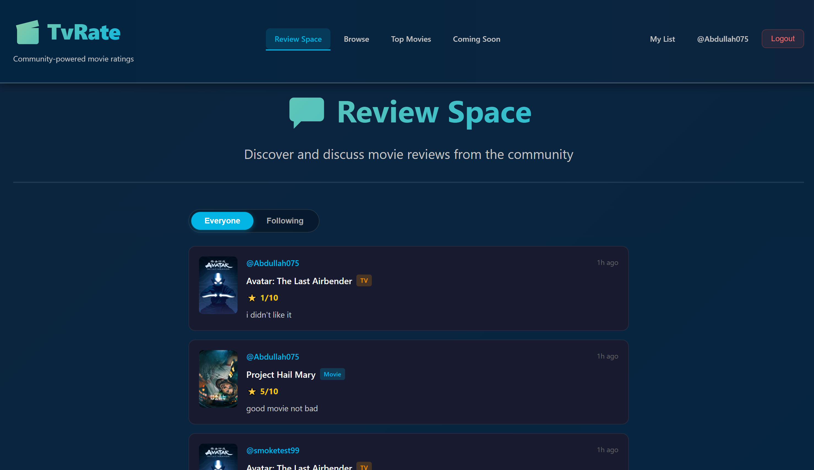
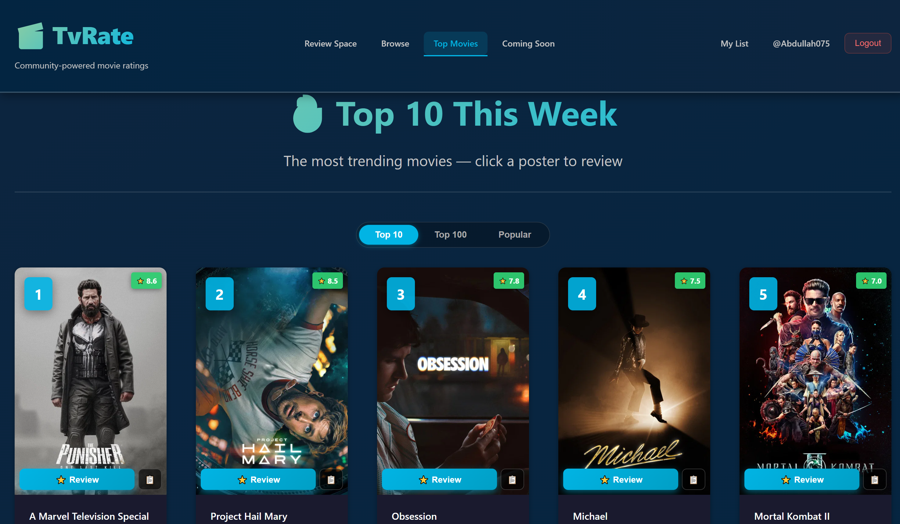

# TvRate

A community-powered movie and TV show rating web application built for CS1445 — Web Application Development.

---

## Overview

TvRate allows users to search for movies and TV shows, write reviews, save items to a watchlist, follow other users, and explore reviews from people they follow. The app runs locally and uses the TMDb API for movie data and posters.

---

## Project Goals

- Build a full-stack web application using Node.js, Express, and MongoDB
- Implement user authentication with sessions and secure password hashing
- Allow users to search and review movies and TV shows
- Create a social layer where users can follow each other and view community reviews
- Use the TMDb API to fetch real movie and TV show data

---

## Features

- User registration and login
- Movie and TV show search (combined)
- People search by username
- Submit reviews with a rating (1–10)
- Add movies or TV shows to a personal watchlist
- Follow and unfollow other users
- View user profiles with reviews, watchlist, followers, and following
- Review Space feed showing reviews from everyone or only followed users
- Top Movies page with Top 10, Top 100, and Popular tabs
- Coming Soon page for upcoming releases
- Movie posters loaded from TMDb

---

## Flow Chart

```
User
 |
 |-- Register / Login
 |
 |-- Browse
 |     |-- Search Movies & TV Shows
 |     |-- Search People by username
 |     |-- Open Review Modal
 |     |-- Add to Watchlist
 |     |-- Follow / Unfollow user
 |
 |-- Review Space
 |     |-- Everyone tab (all reviews)
 |     |-- Following tab (reviews from followed users)
 |
 |-- Top Movies
 |     |-- Top 10 (trending this week)
 |     |-- Top 100 (all-time highest rated)
 |     |-- Popular
 |
 |-- Coming Soon
 |     |-- Upcoming movie releases
 |
 |-- Profile Page
 |     |-- View user reviews
 |     |-- View user watchlist
 |     |-- View followers / following
 |     |-- Edit bio (own profile)
 |
 |-- My List
       |-- View saved watchlist items
```

---

## Setup Instructions

1. **Install dependencies**
   ```
   npm install
   ```

2. **Create a `.env` file** in the project root:
   ```
   PORT=3002
   MONGO_URI=mongodb://127.0.0.1:27017/tvrate
   SESSION_SECRET=your_session_secret
   TMDB_API_KEY=your_tmdb_api_key
   TMDB_ACCESS_TOKEN=your_tmdb_access_token
   ```
   > Do not commit `.env` to version control. It contains secrets.

3. **Start MongoDB**
   Make sure MongoDB is running locally on port 27017.

4. **Start the server**
   ```
   npm start
   ```

5. **Open the app**
   Visit `http://localhost:3002` in your browser.

---

## Technologies Used

| Layer | Technology |
|---|---|
| Frontend | HTML, CSS, JavaScript (ES6 classes) |
| Backend | Node.js, Express.js |
| Database | MongoDB, Mongoose |
| Authentication | express-session, bcrypt |
| Movie Data | TMDb API |
| Security | Helmet, express-rate-limit, DOMPurify |

> Movie images are not stored in MongoDB. The app stores movie references and poster paths, while images are loaded directly from TMDb at runtime.

---

## Screenshots

**Review Space**


**Top Movies**


---

## Future Work

- Add pagination for search results
- Allow users to edit or delete their own reviews
- Show average community rating per movie
- Add email verification on registration
- Deploy to a cloud hosting service

---

## Resources

- [TMDb API](https://developer.themoviedb.org/)
- [Express.js Documentation](https://expressjs.com/)
- [Mongoose Documentation](https://mongoosejs.com/)
- [MongoDB Documentation](https://www.mongodb.com/docs/)
- [bcrypt npm package](https://www.npmjs.com/package/bcrypt)

---

## Team Members

| Name | Student ID |
|---|---|
| Abdullah Alhagbani| 443018344 |
| Abdullah Alwehaibi| 442015909 |

> CS1445 — Web Application Development
